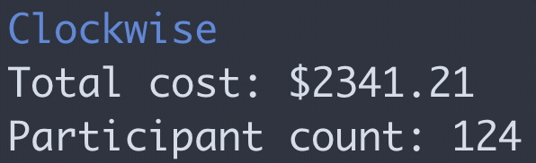

# &orarr;lockwise

Clockwise is a meeting cost calculator designed to encourage more efficient
meetings. 

> The meetings will continue until morale improves.

## Installation
```bash
go get github.com/syncfast/clockwise
```

## Usage
Clockwise supports the ability to automatically scrape participant count from a
zoom meeting by passing the invitation url through the `--url` / `-u` flag. 

```bash
clockwise run --url <zoom meeting url>
```

## Manual input
Alternatively, you can leverage manual input mode, which collects user input via
the TUI to manage participant count. Just exclude the `--url` flag. 

```bash
clockwise run
```

## Configuration
Clockwise relies on a single configuration item: average annual salary per
participant.

This can be approximate, but you can use resources like indeed.com,
glassdoor.com, and levels.fyi to be methodical in your approximation.

`averageSalary` defaults to $150,000 and can be modified by using the `set`
subcommand.

```bash
$ clockwise set
? Set average annual salary of meeting participants: (150000) 
```

Alternatively, you can edit the configuration file directly at
`~/.config/clockwise/clockwise.yaml`.

## TUI
Clockwise outputs total cost to a terminal UI (courtesy
[tcell](https://github.com/gdamore/tcell)) that is refreshed every 500ms.



## Displaying total cost in your Zoom meeting
In conjunction with [OBS](https://obsproject.com/), Clockwise can print your
total meeting cost as it increases in real time to a virtual camera. The virtual
camera can then be consumed by Zoom to passive aggressively remind everyone
precisely how much a given meeting costs. Anecdotally, this raised awareness and
led to more focused and less frequent meetings for my team. To change something,
track it. 

## OBS Configuration
OBS configuration is a bit involved, but it's something that you only need to do
once. Long term, it would be nice to replace OBS with something like FFMPEG that
doesn't depend on an external GUI. 

- Install [OBS](https://obsproject.com/).
    ```bash
    brew install --cask obs
    ```
- Launch OBS.
- In the Sources window, click the `+` icon. 
- Select `Text (FreeType 2)`.
- Click `OK`.
- Check `Read from file`.
- Click `Select Font`.
- Change the `Size` to `144`.
- Click `OK`.
- Scroll down to the `Text File (UTF-8 or UTF-16)` field and click the `Browse`
  button.
- Navigate to `~/Documents/clockwise`.
- Select `clockwise.txt` and click `OK`. 
- Feel free to modify the text font, color, and size to suit your preferences.
  The sky is the limit.
- In the lower right hand corner, click `Start Virtual Camera`. 
- You can optionally add your webcam as a video source as well and make the cost
  a text overlay.
  - In the Sources window, click the `+` icon.
  - Select `Video Capture Device`.
  - Click `OK`.
  - In the `Device` dropdown, select your webcam. 
  - Click `OK`.
  - In the Sources window, make sure that `Video Capture Device` is selected and
    either drag it under your text source or click the down arrow icon.
  - If necessary, stretch your video layer so that it fills the canvas.
  - You can toggle your webcam off at any point by clicking the eye icon to the
    right of `Video Capture Device` in the Sources window.

## Zoom configuration
- If your zoom client is open, restart it (to load the new virtual camera).
- In Zoom, in the lower left hand corner, select the small up arrow next to the
  `Start Video` button.
- Select `OBS Virtual Camera`.
- Click the `Start Video` button. 

That's it! Make sure to add snarky remarks when your meetings drag on for added
effect.

## Contributing
Contributions are welcome and appreciated. This project is in a very early stage
of development and I consider myself a novice Gopher. None of the code is
sacrosanct. Feel free to eviscerate it.

## To do
Most of these are up for grabs. If anything interests you, feel free to open an
issue expressing your intent to tackle it. I'm happy to field questions (to the
best of my ability) as they surface. Needless to say, feel free to submit
feature requests via issues for anything that's not on the list. 
- [ ] Unit test all the things.
- [ ] Explore authenticated web scraping approach.
- [ ] Explore replacing OBS with a solution that doesn't require a GUI, like
  ffmpeg. 
- [ ] Explore time-series based approach.
- [ ] Explore crash recovery solutions.
- [ ] Handle browser startup more gracefully. 
- [ ] Make the TUI prettier.
- [ ] Explore letting the clockwork zoom participant display the meeting cost. 
- [ ] Consider making the clockwork-bot zoom participant name configurable via
  the config file.
- [ ] Implement CI via GH actions.
- [ ] Implement
  [PMI](https://support.zoom.us/hc/en-us/articles/203276937-Using-Personal-Meeting-ID-PMI-)
  handling (likely through a flag). 

## Special thanks
Special thanks to everyone who provided invaluable feedback and input,
including, in no particular order:
- @alenawang
- @redyama
- @DWSR
- @beeekind
- @peterbourgon
- @theckman
- @fergyfresh
- @jcstryker
